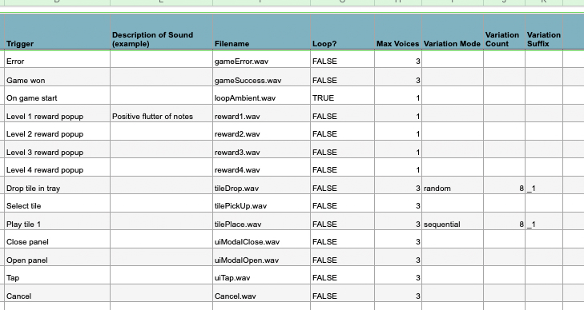

[README.md](https://github.com/user-attachments/files/26424959/README.md)
# AudioManager

A lightweight, event-driven audio manager for cross-platform iOS/Android games and apps. Built on AVFoundation's `AVAudioEngine` and `AVAudioPlayerNode` for iOS, and `SoundPool` for Android. Designed for mobile experiences where the priority is snappy, precise, non-intrusive sound — polyphonic one-shots, sequential variations, and animation-driven sequencing.


[](https://vimeo.com/1191331099)


Built and maintained by [Kristin Miltner](https://kristinmiltner.com).

---

## Features

- **Per-event voice pools** — each sound event has its own configurable voice limit; when the pool is full, the oldest voice is stolen
- **Sequential variations** — cycles through numbered file variants in order, wrapping automatically (e.g. `tilePlace_1` → `_2` → … → `_8` → `_1`)
- **Random no-repeat variations** — picks randomly from numbered variants, never repeating the last played
- **Looping sounds** — start and stop driven by animation callbacks, not timers
- **Buffer caching** — every audio file is read from disk exactly once and held in memory
- **Route change handling** — automatically restarts the engine after headphone/speaker switches

---

## Installation

### iOS (Swift / AVFoundation)

1. Copy `AudioManager.swift` into your Xcode project
2. Add your audio files to the Xcode bundle (drag into the project navigator, check "Copy items if needed")
3. Files should be named to match the `SoundEvent` raw values — e.g. `tilePickUp.wav`, `tileDrop_1.wav` through `tileDrop_8.wav`
4. `AudioManager.shared` is available immediately — no setup call needed

### Android (Kotlin / SoundPool)

1. Copy `AudioManager.kt` into your Android project (e.g. `app/src/main/java/com/yourpackage/audio/`)
2. Add your audio files to `assets/sounds/` — filenames must match the `SoundEvent` raw values exactly, e.g. `tilePickUp.wav`, `tileDrop_1.wav` through `tileDrop_8.wav`
3. Initialize the manager once in your `Application` class or main `Activity`:
```kotlin
AudioManager.init(context)
```

4. Call `play()` from anywhere:
```kotlin
AudioManager.play(SoundEvent.TILE_PICK_UP)
```

---

## Basic Usage

Engineers call `play()` for everything. The manager handles voice allocation, variation selection, and looping internally.

### iOS (Swift)
```swift
// One-shot
AudioManager.shared.play(.tilePickUp)
AudioManager.shared.play(.gameSuccess)
AudioManager.shared.play(.uiTap)

// Variations — no index needed
AudioManager.shared.play(.tileDrop)    // random, never repeats last played
AudioManager.shared.play(.tilePlace)   // sequential: _1, _2 … _8, _1

// Looping — driven by animation callbacks
AudioManager.shared.play(.loopAmbient)   // call when ambient scene begins
AudioManager.shared.stop(.loopAmbient)   // call when ambient scene ends

// Override voice limit if needed
AudioManager.shared.play(.tileDrop, maxVoices: 4)

// Stop everything (e.g. app backgrounding)
AudioManager.shared.stopAll()
```

### Android (Kotlin)
```kotlin
// One-shot
AudioManager.shared.play(SoundEvent.TILE_PICK_UP)
AudioManager.shared.play(SoundEvent.GAME_SUCCESS)
AudioManager.shared.play(SoundEvent.UI_TAP)

// Variations — no index needed
AudioManager.shared.play(SoundEvent.TILE_DROP)    // random, never repeats last played
AudioManager.shared.play(SoundEvent.TILE_PLACE)   // sequential: _1, _2 … _8, _1

// Looping — driven by animation callbacks
AudioManager.shared.play(SoundEvent.LOOP_AMBIENT)   // call when ambient scene begins
AudioManager.shared.stop(SoundEvent.LOOP_AMBIENT)   // call when ambient scene ends

// Override voice limit if needed
AudioManager.shared.play(SoundEvent.TILE_DROP, maxVoices = 4)

// Stop everything (e.g. app backgrounding)
AudioManager.stopAll()
```

---

## Adding a New Sound Event

Sound events are defined in `SoundEventList.csv`, exported from the sound designer's asset list. `SoundEvent.swift` and `SoundEvent.kt` are auto-generated from the CSV at build time.

In your exported `SoundEventList.csv`, as long as you have these columns, the generator will pick up the entire sound manifest and its parameters: `Filename`, `Loop?`, `Max Voices`, `Category`, `Trigger` — and if any sounds have variations, also `Variation Mode`, `Variation Count`, and `Variation Suffix`. Any additional columns are ignored.

1. **Export** `SoundEventList.csv` from your asset list spreadsheet to the repo root

   
2. **Add the audio file(s)** to the app bundle:
   - iOS: drag into Xcode under the `Sounds` group
   - Android: place in `app/src/main/assets/sounds/`
3. **Build** — the generator runs automatically and the new event is available immediately

```swift
// iOS — available as soon as the build succeeds
AudioManager.shared.play(.myNewSound)
```

```kotlin
// Android
AudioManager.shared.play(SoundEvent.MY_NEW_SOUND)
```

No enum edits, no code changes required.

---

## Configuring Voice Pools and Variations

All audio design decisions live in `SoundEventList.csv` — not at the call site and not in code. Engineers never have to think about how many voices a sound needs or how its variations behave.

### CSV Columns

| Column | Required | Description |
|---|---|---|
| `Filename` | ✓ | Audio filename including extension, e.g. `tilePickUp.wav` |
| `Loop?` | ✓ | `TRUE` or `FALSE` |
| `Max Voices` | ✓ | Max simultaneous voices. Default is 3. When full, oldest voice is stolen |
| `Variation Mode` | | `random` or `sequential`. Leave blank for single-file events |
| `Variation Count` | | Number of variation files. Leave blank for single-file events |
| `Variation Suffix` | | Suffix pattern for variation filenames, e.g. `_1` → `tileDrop_1.wav`. Supports `_1`, `1`, or `01` (zero-padded) |
| `Category` | | Groups events into sections in the test app UI |
| `Trigger` | | Human-readable label shown in the test app UI |

Any additional columns (status tracking, notes, etc.) are ignored by the generator.

### Variation File Naming

| Suffix style | Files generated |
|---|---|
| `_1` (default) | `eventName_1.wav`, `eventName_2.wav`, … |
| `1` | `eventName1.wav`, `eventName2.wav`, … |
| `01` | `eventName01.wav`, `eventName02.wav`, … |

---

## Debug App

The repo includes companion test apps for iOS (`SoundTest_Swift`) and Android (`SoundTest_Android`) for auditioning sounds and verifying manager behavior during development and QA.

[](https://vimeo.com/1191331099)

### Features

- One button per sound event
- Variation display — shows which variant just played (e.g. `tileDrop → _4`)
- Voice count indicator — shows active voices per event to verify pool limits
- Loop toggle buttons for looping sounds
- Stop All button

### Usage

Open `SoundTest_Swift` in Xcode or `SoundTest_Android` in Android Studio, add your audio files to the bundle, build and run on device. Tap any button to trigger its sound event and observe the display.

The test apps are intended as a shared tool between sound designer and engineering — a fast way to audition sounds in context, verify variation behavior, and QA audio events without needing a full game build.

---

## Sound Event List

The full list of sound events is in [SoundEventList.csv](SoundEventList.csv). This is the source of truth for both platforms — edit it in any spreadsheet app (Numbers, Excel, Google Sheets) and export as `.csv` to the repo root before building.

## Code Generation

`SoundEvent.swift` and `SoundEvent.kt` are auto-generated from `SoundEventList.csv` by `scripts/generate_sound_events.py`. Both Xcode and Android Studio run the script automatically as a pre-build step — you never need to run it manually.

To run it manually (e.g. to inspect the output before building):

```bash
python3 scripts/generate_sound_events.py
```

Note: While you _can_ manually add sound events to `SoundEvent.swift` or `SoundEvent.kt` directly, those changes will be overwritten on next build.

---

## File Naming Convention

| Event type | Filename format |
|---|---|
| Single sound | `eventName.wav` |
| Variations | `eventName_1.wav`, `eventName_2.wav`, … |
| Case-sensitive | Must match `SoundEvent` raw value exactly |

All files should be 44.1kHz / 16-bit WAV unless otherwise specified.

---

## Requirements

### iOS
- iOS 14+
- Swift 5.7+
- AVFoundation (system framework, no additional dependencies)

### Android
- Android API 21+ (Lollipop)
- Kotlin 1.7+
- SoundPool (system framework, no additional dependencies)
